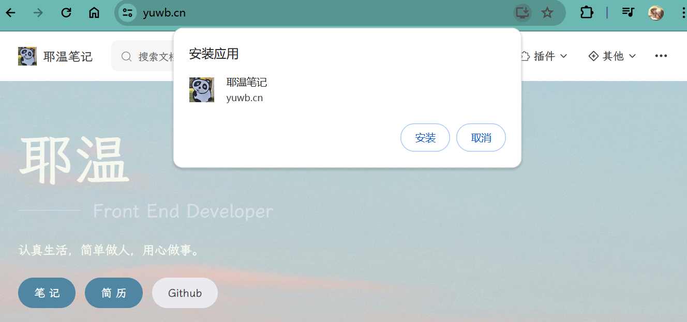

# VuePress开启PWA

## 创建manifest

`.vuepress/public`文件下创建`manifest.json`

```json
{
    "lang": "zh-cn",
    "name": "WIKIDOC笔记",
    "short_name": "WIKIDOC笔记",
    "description": "WIKIDOC学习笔记",
    "start_url": "/",
    "background_color": "#2f3d58",
    "theme_color": "#2f3d58",
    "orientation": "any",
    "display": "standalone",
    "icons": [
        {
            "src": "/logo.png",
            "sizes": "144x144"
        }
    ]
}
```

## 加载manifest

`.vuepress/config.js`添加一下代码

```js

export default defineUserConfig({
    ...
    ...
     head: [
        // 引入manifest 开启PWA
        ['link', {
            rel: 'manifest',
            href: '/manifest.json'
        }]
    ],
})
```

## 开启Service Worker

`.vuepress/config.js`添加一下代码

```js

export default defineUserConfig({
    ...
    ...
    serviceWorker:true
})
```

## 测试结果


