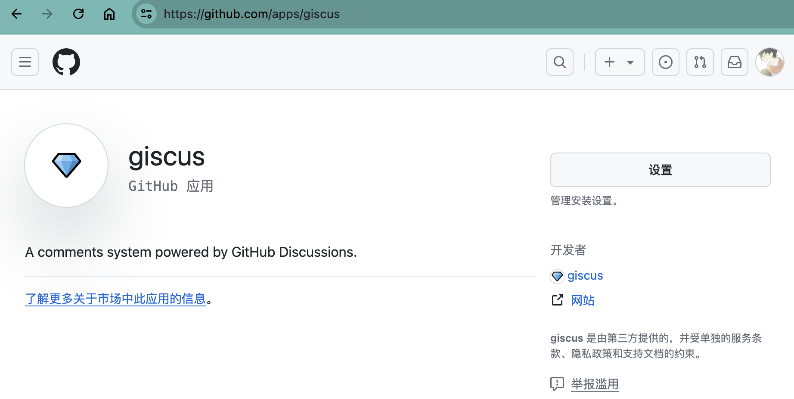
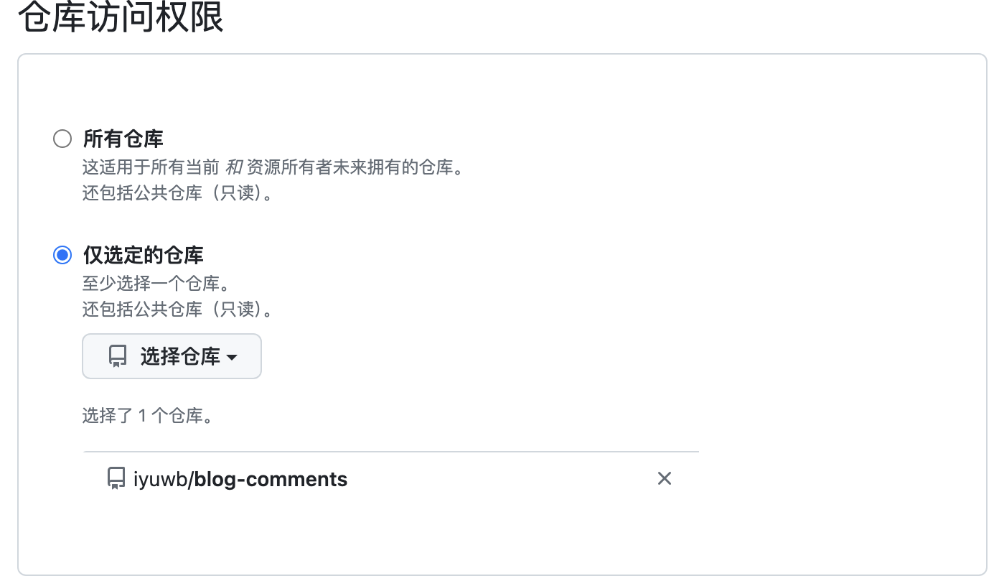
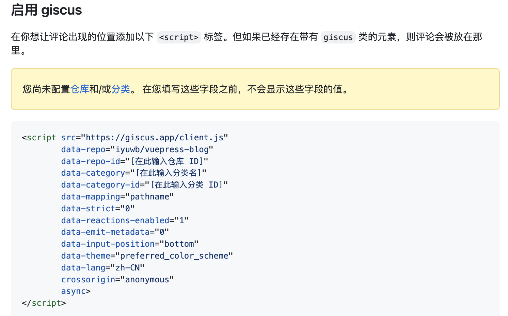

# 个人网站开启Giscus评论

Giscus 是一个开源的评论系统，它允许你在静态网站或博客上使用 GitHub 登录的用户进行讨论。Giscus 通过 GitHub 的议题（Issues）功能来实现这一目的，因此所有评论实际上都是存储在你的 GitHub 仓库中，这不仅简化了评论管理，还利用了GitHub的权限管理和通知系统。这种方式有利于促进社区互动，同时保持内容的可管理性和长期可持续性。

## 简介

- 易于集成：只需添加一小段代码到你的网站，即可快速启用评论功能。
- 实时更新：评论支持实时加载和更新，提升用户体验。
- GitHub 身份验证：用户需使用 GitHub 账号登录，有助于减少垃圾信息。
- 自定义性：提供多种主题样式，可调整以匹配你的网站设计。
- 开源免费：Giscus 是一个开源项目，遵循 MIT 许可证，对个人和商业项目均免费开放。

## 使用步骤

### 创建Github仓库

首先，你需要有一个 GitHub 账号，并创建一个新的仓库用于存放评论议题。这个仓库需要设置为公开。并且需要在仓库设置页面开放评论选项。

### 安装Giscus App

> https://github.com/apps/giscus

Giscus 应用库可以帮助你更方便地管理设置。通过上述网站进入安装页面，直接安装。

安装完成之后，点击设置，进入Giscus 设置页面。设置仓库访问权限，选择自己刚刚新建的用来当做评论的仓库。

### 配置Giscus

> https://giscus.app/zh-CN

通过上述链接，进入配置Giscus页面。下拉，根据自己需求，分别配置语言、仓库、页面 ↔️ discussion 映射关系、Discussion 和主题分类。

### 嵌入到网站
配置完成之后，在 启用giscus  下面有一段带有`<script>`标签的代码，嵌入到自己网站的合适位置即可。

